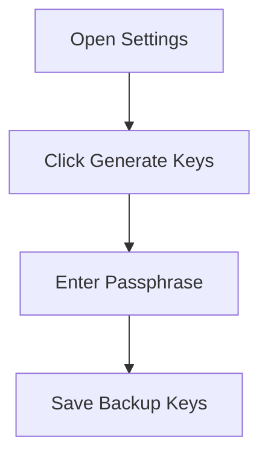

# Discord_PGP

Here's an optimized GitHub-ready `README.md` with proper formatting and sections that will display well on your repository page:

# 🔐 BetterDiscord PGP Encryption Plugin


A secure end-to-end encryption plugin for Discord using OpenPGP.js with modern Curve25519 cryptography.

 *(Replace with actual screenshot)*

## ✨ Features

| Feature | Description |
|---------|-------------|
| **🔒 Military-grade Encryption** | Uses OpenPGP.js with Curve25519 ECC |
| **🛡️ Secure Key Handling** | Passphrases never stored, keys encrypted at rest |
| **💻 User-Friendly UI** | One-click encryption/decryption |
| **📦 Self-contained** | No external dependencies beyond BetterDiscord |

## 🚀 Installation

### Prerequisites
- [BetterDiscord](https://betterdiscord.app/) installed

### Method 1: Direct Download
1. Download the [latest release](https://github.com/yourusername/betterdiscord-pgp/releases)
2. Place `PGPEncrypt.plugin.js` in your plugins folder:
   ```
   %appdata%\BetterDiscord\plugins\  # Windows
   ~/Library/Application Support/betterdiscord/plugins/  # Mac
   ~/.config/BetterDiscord/plugins/  # Linux
   ```
3. Reload Discord (Ctrl+R)

### Method 2: Git Clone
```bash
git clone https://github.com/yourusername/betterdiscord-pgp.git
cp betterdiscord-pgp/PGPEncrypt.plugin.js "your_plugins_folder"
```

## 🛠️ Usage

### Initial Setup
1. Open Discord Settings → Plugins
2. Enable "PGPEncrypt"
3. Click the ⚙️ icon to open settings

### Generating Keys


### Sending Encrypted Messages
1. Click the 🔒 icon in message composer
2. Type your message
3. Send - encryption happens automatically

## ⚠️ Security Considerations

**Important Limitations:**
- Metadata (who/when) remains visible
- BetterDiscord plugins have inherent security risks
- Not suitable for life-critical communications

**Best Practices:**
- 🔄 Rotate keys periodically
- 🔍 Verify keys through secondary channels
- 🗑️ Clear keys when not in use
- 💾 Use full-disk encryption for added security

## 🤝 Contributing

I welcome contributions! Please follow these steps:

1. Fork the repository
2. Create a feature branch (`git checkout -b feature/AmazingFeature`)
3. Commit your changes (`git commit -m 'Add some AmazingFeature'`)
4. Push to the branch (`git push origin feature/AmazingFeature`)
5. Open a Pull Request

---

Made with ❤️ and 🔐 by Leonardo Parchão
